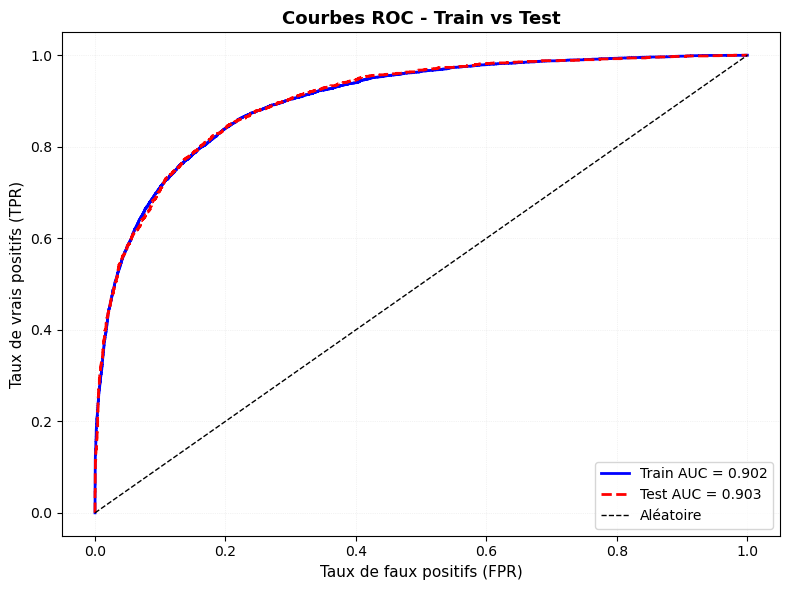
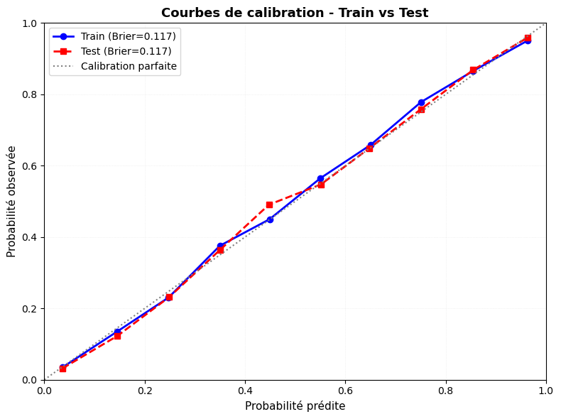
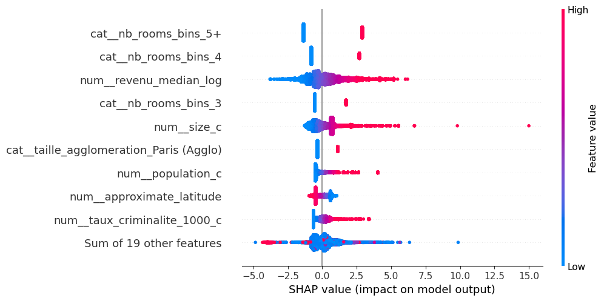

# Projet de Classification de Biens Immobiliers  
### Workflow Data Science Complet – De la donnée brute au modèle interprétable

## Présentation

Ce projet vise à prédire si un bien immobilier appartient à la catégorie des biens à prix élevé à partir :

- des caractéristiques intrinsèques du bien (surface, nombre de pièces, type de bien),
- du contexte socio-économique local (revenu médian, population, criminalité),
- d’indicateurs d’attractivité territoriale,
- et de données open data issues de data.gouv (INSEE, statistiques locales, Base Permanente des Équipements).

L’objectif n’est pas uniquement prédictif : le projet est conçu comme un workflow data science structuré et reproductible, allant de la donnée brute à un modèle interprétable et industrialisable.

---

## Workflow analytique

Le projet suit une logique progressive :

1. Intégration et enrichissement des données  
2. EDA et nettoyage  
3. Contrôle qualité systématique  
4. Analyse économétrique  
5. Feature engineering  
6. Modélisation machine learning  
7. Interprétabilité  
8. Exécution complète automatisée  

Chaque étape est validée avant de passer à la suivante.

---

## Structure du repository

- `01_data/` → Données brutes et transformées  
- `02_notebooks/` → Exploration, économétrie, ML, SHAP  
- `03_fonctions/` → Modules Python (logique métier réutilisable)  
- `04_model/` → Modèle entraîné sauvegardé  
- `05_visualisations/` → Figures utilisées dans le README  

### Détail des notebooks – `02_notebooks/`

- `01_merge.ipynb` → Intégration des données open data  
- `02-04_eda.ipynb` → Exploration et nettoyage progressif  
- `05_econometrics.ipynb` → Modèle logit explicatif  
- `06_cleaning_post_econometrics.ipynb` → Préparation finale des variables  
- `07_machine_learning.ipynb` → Pipeline ML et optimisation  
- `08_shap_interpretation.ipynb` → Analyse SHAP  
- `09_script_complet.ipynb` → Exécution end-to-end  

### Logique métier – `03_fonctions/`

Les notebooks contiennent la logique analytique et les visualisations.  
La logique métier est implémentée dans des modules Python :

- `merge/` → Fusion des données externes  
- `econometrics/` → Nettoyage et transformations guidées par l’analyse économétrique  
- `model/logistic_regression.py` → Construction de la pipeline ML (régression logistique pénalisée)  
- `script_complet/pipeline.py` → Orchestration complète du workflow  

Cette séparation permet :

- Modularité  
- Réutilisabilité  
- Reproductibilité  
- Exécution automatisée  

---

## Contrôle qualité

Un contrôle qualité via **Great Expectations** est appliqué à chaque étape clé du pipeline :

- validation de structure,  
- cohérence des types,  
- absence d’anomalies critiques,  
- vérifications de contraintes métier et statistiques.

L’objectif est de sécuriser la donnée avant toute modélisation.

---

## Modélisation

La modélisation repose sur une **régression logistique pénalisée (L2)** intégrée dans une pipeline scikit-learn complète :

- Imputation des valeurs manquantes (`IterativeImputer`)  
- Encodage des variables catégorielles en One-Hot  
- Standardisation des variables numériques  
- Optimisation des hyperparamètres via `RandomizedSearchCV`  
- Sauvegarde du modèle final sur disque

### Performances (indicatives)

- ROC-AUC ≈ 0.90  
- Average Precision ≈ 0.85  
- Brier Score ≈ 0.117  
- Bonne stabilité train/test  

---

## Courbes ROC et calibration

  

La courbe ROC montre que le modèle surperforme largement une classification aléatoire, avec une surface sous la courbe (AUC) d’environ 0,90, ce qui traduit une très bonne capacité à discriminer les biens à prix élevé des autres.  
Les points sont proches de l’axe supérieur gauche, ce qui indique un bon compromis entre taux de vrais positifs et taux de faux positifs sur une large plage de seuils de décision.

  

La courbe de calibration montre une bonne adéquation entre probabilités prédites et probabilités observées, ce qui est cohérent avec un Brier Score faible.  
Les probabilités produites par le modèle peuvent ainsi être interprétées comme des scores de risque fiables pour la prise de décision métier.

---

## Interprétabilité – SHAP

  

L’analyse SHAP permet :

- d’identifier les variables les plus influentes,  
- d’analyser le sens des contributions,  
- de relier les résultats prédictifs à l’analyse économétrique.

Les variables liées au revenu médian, au nombre de pièces et à la localisation ressortent comme particulièrement structurantes.  
Elles confirment que le modèle capture des effets économiques et territoriaux cohérents avec l’intuition métier sur les marchés immobiliers locaux.

---

## Exécution

Le pipeline complet peut être exécuté :

- via le module Python : `03_fonctions/script_complet/pipeline.py`  
- ou depuis le notebook : `02_notebooks/09_script_complet.ipynb`

Le modèle final est sauvegardé dans :

- `04_model/housing_logit_model.joblib`

---

## Remarque importante

Le projet n’est pas entièrement clonable en l’état car le fichier suivant est exclu du dépôt (volume important) :

- `01_data/01_raw/bpe_24.parquet`

Il correspond aux données de la **Base Permanente des Équipements (BPE)** et doit être téléchargé depuis [data.gouv.fr](https://www.data.gouv.fr/) avant d’exécuter le pipeline complet.

---

## Conclusion

Ce projet illustre un workflow data science complet :

- Intégration open data  
- EDA structurée  
- Contrôle qualité rigoureux  
- Analyse économétrique explicative  
- Pipeline ML optimisée  
- Interprétabilité avancée  
- Automatisation de bout en bout  

Il met en avant une approche combinant rigueur statistique, structuration du code et robustesse prédictive.
